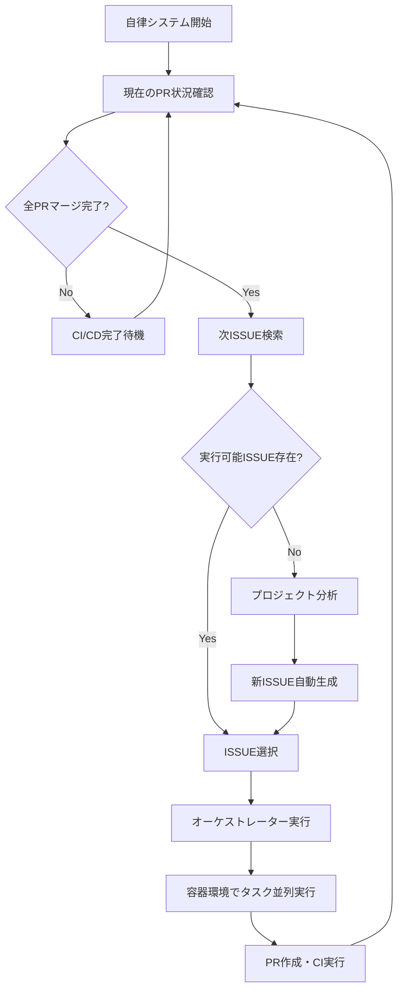

# 🤖 自律開発システム - 完全ガイド

Claude Codeが完全自律でプロジェクトを継続発展させるシステムの総合ドキュメント。

---

## 🎯 システム概要

### 自律開発サイクル


### 主要機能
- 🔄 **完全自律実行**: 人間の介入なしで継続的に開発
- 🎯 **インテリジェントISSUE選択**: AI分析による最適タスク選択  
- 🏭 **並列実行**: container-use環境での高効率タスク処理
- 📊 **プロジェクト分析**: コードベース解析による改善点自動発見
- 🔍 **PR監視**: CI/CD完了とマージを自動監視
- 📈 **継続的改善**: 実行結果から学習して最適化

---

## 📁 システム構成

### コマンドファイル構成
```
.claude/commands/
├── autonomous.md                    # 統合実行コマンド（メインインターフェース）
├── autonomous-orchestrator.md       # 自律オーケストレーター
├── autonomous-pr-monitor.md         # PR監視システム
├── autonomous-issue-manager.md      # ISSUE管理システム
├── orchestrator.md                  # 基本オーケストレーター（container-use対応）
└── README-autonomous.md            # このファイル
```

### システム関係図
```text
[autonomous.md] - 統合制御コマンド
    │
    ├─ [orchestrator.md] - タスク実行エンジン
    │   └─ container-use環境での並列実行
    │
    ├─ [autonomous-pr-monitor.md] - PR/CI監視
    │   ├─ GitHub API統合
    │   ├─ CI/CDステータス監視
    │   └─ 自動マージ処理
    │
    ├─ [autonomous-issue-manager.md] - ISSUE管理
    │   ├─ ISSUE検索・優先度判定
    │   ├─ プロジェクト分析
    │   └─ 自動ISSUE生成
    │
    └─ [autonomous-orchestrator.md] - 自律実行制御
        ├─ 実行サイクル管理
        ├─ エラーハンドリング
        └─ メトリクス・レポート
```

---

## 🚀 クイックスタート

### 1. システム開始
```bash
# 基本的な自律実行開始
/autonomous start

# カスタム設定で開始
/autonomous start --interval=15 --max-wait=1h

# ドライランモード（実際の変更なし）
/autonomous start --dry-run
```

### 2. 状況確認
```bash
# 現在の実行状況確認
/autonomous status

# 詳細情報表示
/autonomous status --detailed

# リアルタイム監視
/autonomous logs --follow
```

### 3. 手動制御
```bash
# 手動でサイクル実行
/autonomous cycle

# 特定ISSUE強制実行
/autonomous cycle --issue-id=123

# PR監視のみ実行
/autonomous cycle --pr-check-only
```

### 4. システム停止
```bash
# 現在のタスク完了後に停止
/autonomous stop

# 即座停止
/autonomous stop --force
```

---

## ⚙️ 設定管理

### 基本設定
```bash
# 全設定表示
/autonomous config show

# サイクル間隔変更（分）
/autonomous config set cycle_interval_minutes 15

# 同時実行PR数制限
/autonomous config set max_concurrent_prs 5

# 自動マージ有効化
/autonomous config set auto_merge_enabled true
```

### 高度な設定
```bash
# ISSUE検索ラベル追加
/autonomous config add search_labels "enhancement"

# 除外ラベル追加  
/autonomous config add exclude_labels "needs-design"

# 通知レベル設定
/autonomous config set notification_level "warn"
```

---

## 📊 監視・メトリクス

### リアルタイム監視
```bash
# ライブログ監視
/autonomous logs --follow

# エラーのみ表示
/autonomous logs --filter=error --last=24h

# パフォーマンスメトリクス
/autonomous logs --metrics --period=week
```

### レポート生成
```bash
# 週次レポート
/autonomous report --type=weekly

# 月次インパクト分析
/autonomous report --type=monthly --export=pdf

# カスタム期間レポート
/autonomous report --from=2024-06-01 --to=2024-06-30
```

---

## 🎛️ 各サブシステム詳細

### 1. オーケストレーター (`orchestrator.md`)
**役割**: 複雑なタスクを独立可能な粒度に分解し、container-use環境で並列実行

**特徴**:
- Task Tools による並列実行最適化
- 独立したcontainer-use環境での作業
- 動的タスク管理と適応的制御
- 品質ゲートと自動検証

**使用例**:
```bash
/orchestrator "新しいAPI認証システムを実装してください"
# → 自動的に以下に分解・並列実行:
#   - 認証ロジック実装 (container-1)
#   - API エンドポイント作成 (container-2)  
#   - テスト作成 (container-3)
#   - ドキュメント更新 (container-4)
```

### 2. PR監視システム (`autonomous-pr-monitor.md`)
**役割**: PR作成後のCI/CD監視とマージ管理の完全自動化

**監視内容**:
- CI/CDパイプライン実行状況
- セキュリティスキャン結果
- コード品質チェック
- レビュー承認状況
- マージコンフリクト検出

**自動処理**:
- CI失敗時の自動リトライ
- レビュー要求自動送信
- 軽微なコンフリクト自動解決
- 条件満たした際の自動マージ

### 3. ISSUE管理システム (`autonomous-issue-manager.md`)
**役割**: 実行可能なISSUEの検索と、不足時の自動生成

**検索アルゴリズム**:
- 優先度マトリクス評価
- 実行可能性スコア計算
- 複雑度と影響度バランス分析
- 依存関係解決確認

**自動生成機能**:
- プロジェクト分析による改善点発見
- コード品質・パフォーマンス・セキュリティ観点
- 適切な難易度とスコープ設定
- 明確な完了条件定義

### 4. 自律実行制御 (`autonomous-orchestrator.md`)
**役割**: システム全体の生命周期管理と最適化

**制御機能**:
- 実行サイクル管理
- エラー検出と自動回復
- リソース使用量最適化
- パフォーマンス監視

**学習機能**:
- 成功パターン分析
- 失敗要因特定
- 動的優先度調整
- 予測的メンテナンス

---

## 🔧 カスタマイズガイド

### 1. プロジェクト固有設定
```yaml
# .claude/autonomous-config.yaml にプロジェクト設定追加

project_specific:
  # 特定技術スタックの優先
  preferred_technologies:
    - "typescript"
    - "react"
    - "nodejs"
    
  # プロジェクト固有ラベル
  custom_labels:
    - "frontend"
    - "backend"
    - "database"
    
  # 特定ファイル除外
  exclude_patterns:
    - "generated/*"
    - "vendor/*"
    - "*.min.js"
    
  # カスタム品質ゲート
  quality_thresholds:
    min_test_coverage: 85
    max_bundle_size_mb: 2
    max_load_time_ms: 1000
```

### 2. 通知チャンネル追加
```yaml
notifications:
  slack:
    enabled: true
    webhook_url: "${SLACK_WEBHOOK_URL}"
    channels:
      - "#development"
      - "#code-reviews"
      
  email:
    enabled: true
    smtp_server: "smtp.example.com"
    recipients:
      - "team@example.com"
      
  discord:
    enabled: false
    webhook_url: "${DISCORD_WEBHOOK_URL}"
```

### 3. カスタムISSUEテンプレート
```yaml
issue_templates:
  custom_performance:
    title_pattern: "[PERF] {component}の最適化"
    description_template: |
      ## パフォーマンス最適化タスク
      
      ### 現在の問題
      {performance_issues}
      
      ### 最適化アプローチ
      {optimization_strategy}
      
      ### 成功指標
      {success_metrics}
      
    labels: ["performance", "optimization", "auto-generated"]
    priority: "high"
```

---

## 🚨 トラブルシューティング

### よくある問題と解決法

#### 1. システムが応答しない
```bash
# 状態確認
/autonomous status

# 強制停止・再起動
/autonomous stop --force
/autonomous start --resume
```

#### 2. CI/CDが継続的に失敗
```bash
# CI失敗パターン分析
/autonomous logs --filter=ci_failure --last=24h

# 一時的にCI監視停止
/autonomous config set ci_monitoring_enabled false
```

#### 3. 不適切なISSUEが選択される
```bash
# ISSUE選択基準確認
/autonomous config show issue_management

# 優先度重み調整
/autonomous config set priority_weights.code_quality 90
```

#### 4. リソース使用量が高い
```bash
# 並列実行数制限
/autonomous config set max_concurrent_prs 2

# サイクル間隔延長
/autonomous config set cycle_interval_minutes 60
```

### ログ分析
```bash
# エラーパターン分析
/autonomous logs --analyze --period=week

# パフォーマンス問題特定
/autonomous logs --performance --slow-only

# API使用量確認
/autonomous logs --api-usage --detailed
```

---

## 📈 成功指標とKPI

### システム効率性
- **完了ISSUE数/週**: 10-15個が理想
- **サイクル完了率**: 90%以上
- **平均サイクル時間**: 2-4時間
- **CI成功率**: 85%以上

### コード品質
- **レビュー一発承認率**: 75%以上  
- **バグ導入率**: 5%以下
- **テストカバレッジ維持**: 80%以上
- **セキュリティスキャン合格率**: 100%

### チーム生産性
- **手動介入率**: 10%以下
- **開発者待機時間**: 20%以下
- **自動化によるコスト削減**: 月40時間以上
- **機能開発速度向上**: 2-3倍

---

## 🔮 将来の拡張計画

### Phase 1: インテリジェンス強化
- ML による ISSUE 優先度学習
- コードレビュー品質予測
- 開発者作業パターン分析

### Phase 2: 多プロジェクト対応
- 複数リポジトリ横断管理
- プロジェクト間依存関係解決
- リソース配分最適化

### Phase 3: 高度な自動化
- 設計段階からの自動実装
- ユーザーフィードバック自動反映
- 自動A/Bテスト実行

---

## 🤝 コントリビューション

### システム改善提案
自律システムの改善提案は以下の形式でISSUEを作成してください：

```markdown
# [AUTONOMOUS] システム改善提案: {改善内容}

## 現在の問題
{具体的な問題点}

## 提案する改善
{改善案の詳細}

## 期待される効果
{改善による効果}

## 実装方針
{実装アプローチ}
```

### カスタマイゼーション共有
プロジェクト固有のカスタマイゼーションは`.claude/extensions/`に配置し、コミュニティと共有できます。

---

この自律開発システムにより、**プロジェクトが人間の継続的な監視なしに自発的に改善・発展**していく未来が実現します。🚀