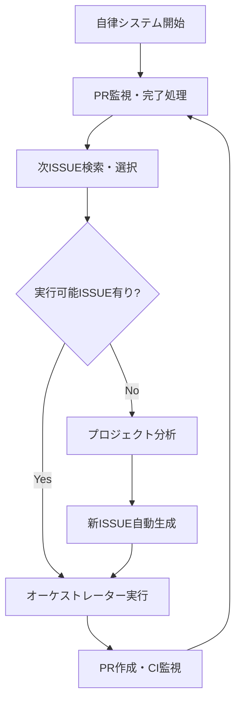

# 🚀 プロジェクト専用コマンドシステム

Claude Codeの推奨パターンに従って構築された、高度な自律開発システムとプロジェクト管理コマンドです。

---

## 🎯 コマンド概要

### 🤖 自律開発システム
- **`/auto`** - 完全自律でプロジェクトを継続発展させるメインシステム
- **`/help`** - 全コマンドのヘルプとガイド

### 🎼 タスク実行システム  
- **`/task`** - 単一タスクの効率的実行（1-4時間程度）
- **`/orchestrate`** - 複雑タスクの分解・並列実行（4時間以上）

### 🔍 分析・改善システム
- **`/analyze`** - プロジェクト分析と改善提案生成

---

## 🚀 クイックスタート

### 1. 自律開発システムの開始
```bash
# 基本的な自律実行開始
/auto start

# カスタム設定で開始  
/auto start --interval=15 --dry-run

# 現在状況確認
/auto status --detailed
```

### 2. 個別タスクの実行
```bash
# シンプルなタスク
/task "ユーザーログイン時のバリデーションエラーを修正"

# 複雑なタスク
/orchestrate "決済システム全体のリファクタリングを実行"
```

### 3. プロジェクト分析
```bash
# 包括的分析
/analyze

# 特化分析
/analyze performance
/analyze security
```

---

## 🎛️ 自律開発システムの仕組み

### 完全自律サイクル


### 主要機能
- 🔄 **無限ループ実行**: 人間の介入なしで継続的に動作
- 🎯 **インテリジェント選択**: AI分析による最適タスク選択
- 🏭 **並列処理**: container-use環境での高効率実行
- 📊 **自動分析**: プロジェクト健全性の継続監視
- 🔍 **PR監視**: CI/CD完了とマージの自動管理
- 📈 **学習機能**: 実行結果から継続的に最適化

---

## 📊 コマンド詳細仕様

### `/auto` - 自律開発システム制御
Claude Codeのベストプラクティスに従った統合制御インターフェース。

**主要アクション**:
- `start [options]` - 自律実行開始
- `status [options]` - 現在状況表示  
- `cycle [options]` - 手動サイクル実行
- `stop [options]` - システム停止
- `config <action>` - 設定管理
- `logs [options]` - ログ・メトリクス確認

**特徴**:
- 引数バリデーションとエラーハンドリング
- 段階的な複雑度対応（シンプル→詳細→エキスパート）
- リアルタイム状況監視
- 設定の永続化と復元

### `/task` - 効率的単一タスク実行
適切な規模のタスクを最適な手法で実行。

**実行パターン自動選択**:
- **直接実行**: 1-3ファイル修正、明確な作業内容
- **Task Tools活用**: 複数コンポーネント、調査分析必要
- **Container-Use**: 新機能、環境構築必要

**自動エスカレーション**:
複雑度閾値超過時に`/orchestrate`を自動推奨

### `/orchestrate` - 複雑タスクの並列実行
Claude CodeのTask Toolsとcontainer-use環境を最大活用。

**並列実行戦略**:
- 独立可能な粒度への自動分解
- container-use環境での完全並列処理
- 動的リソース管理と負荷分散
- 品質ゲートによる自動検証

### `/analyze` - 包括的プロジェクト分析
データドリブンな改善計画立案を支援。

**分析スコープ**:
- `all` - 包括的健全性チェック
- `code` - コード品質・アーキテクチャ
- `performance` - パフォーマンス・リソース
- `security` - セキュリティ・脆弱性
- `dependencies` - 依存関係・ライブラリ
- `tests` - テストカバレッジ・品質

---

## ⚙️ 設定とカスタマイゼーション

### プロジェクト設定
```yaml
# .claude/autonomous-config.yaml
autonomous_system:
  enabled: true
  cycle_interval_minutes: 30
  max_concurrent_prs: 3
  auto_merge_enabled: false
  
issue_management:
  auto_creation_enabled: true
  search_labels: ["ready-for-development", "approved"]
  exclude_labels: ["blocked", "waiting-for-review"]
  
quality_gates:
  min_code_coverage: 80
  require_security_scan: true
  max_complexity_score: 15
```

### 実行状態管理
```json
{
  "autonomous_state": {
    "status": "running",
    "current_cycle": 47,
    "completed_issues": 23,
    "success_rate": 0.94,
    "monitoring_prs": [...],
    "recent_completions": [...]
  }
}
```

---

## 🎯 使用場面別ガイド

### 🚀 新プロジェクト立ち上げ
```bash
# 1. 初期分析でベースライン確立
/analyze

# 2. 基本的な改善を実行
/task "lintとformatterの設定を追加"
/task "基本的なCI/CDパイプラインを構築"

# 3. 自律システム開始
/auto start
```

### 🔧 既存プロジェクト改善
```bash
# 1. 現状把握
/analyze --export=json

# 2. 緊急対応
/task "セキュリティ脆弱性を修正"

# 3. 計画的改善
/orchestrate "パフォーマンス最適化を包括的に実施"

# 4. 継続的改善開始
/auto start --interval=60
```

### 🏗️ 大規模機能開発
```bash
# 複雑な機能は自動分解・並列実行
/orchestrate "ユーザー認証システム全体を実装"

# 結果: 自動的に以下に分解・並列実行
# - 認証API実装 (container-1)
# - フロントエンド実装 (container-2)  
# - テスト作成 (container-3)
# - ドキュメント更新 (container-4)
```

### 📊 継続的監視・メンテナンス
```bash
# 自律システムの監視
/auto status --metrics

# 定期的な健全性チェック
/analyze --compare=last-month

# パフォーマンス最適化
/analyze performance
/task "特定されたボトルネックを解消"
```

---

## 📈 効果測定と成果

### 期待される効果
- **開発効率**: 60-80%向上（並列処理とオートメーション）
- **コード品質**: 継続的分析と自動改善
- **プロジェクト健全性**: データドリブンな監視
- **技術的負債**: 予防的メンテナンス
- **チーム生産性**: 手動作業の大幅削減

### 測定指標
```yaml
productivity_metrics:
  issues_completed_per_week: 12-15
  pr_merge_success_rate: 90%+
  ci_failure_rate: <10%
  average_cycle_time: 2-4 hours
  
quality_metrics:
  code_coverage: 80%+
  security_scan_pass_rate: 100%
  performance_regression_rate: <5%
  review_approval_rate: 85%+
  
efficiency_metrics:
  manual_intervention_rate: <10%
  automated_task_success_rate: 90%+
  resource_utilization: 70-85%
  cost_reduction: 40+ hours/month
```

---

## 🚨 トラブルシューティング

### よくある問題
- **コマンド認識されない** → ファイル配置・形式確認
- **自律システム動作しない** → GitHub API認証・権限確認
- **分析結果が期待と違う** → 分析設定・対象スコープ調整
- **container-use環境エラー** → Docker環境・リソース確認

### デバッグ手順
```bash
# 基本的なデバッグフロー
/help <command>           # コマンド仕様確認
/auto logs --filter=error # エラーログ分析
/auto config show         # 設定状況確認
/auto cycle --dry-run     # シミュレーション実行
```

---

## 🔮 拡張・カスタマイゼーション

### カスタムコマンド追加
```bash
# 新しいコマンドファイル作成
echo "プロジェクト固有のタスクを実行: $ARGUMENTS" > .claude/commands/custom.md

# 使用例
/custom "特定の要件に基づくカスタム処理"
```

### プロジェクト固有設定
```yaml
# .claude/project-extensions.yaml
custom_workflows:
  deployment: "自動デプロイメントワークフロー"
  monitoring: "カスタム監視設定"  
  integration: "外部システム統合"
```

---

## 📚 関連リソース

- **Claude Code公式ドキュメント**: https://docs.anthropic.com/ja/docs/claude-code
- **スラッシュコマンド仕様**: https://docs.anthropic.com/ja/docs/claude-code/slash-commands
- **ベストプラクティス**: プロジェクト内 README-autonomous.md
- **詳細設定**: 各コマンドファイル内の設定セクション

---

この高度なコマンドシステムにより、Claude Codeの能力を最大限活用した**完全自律の継続的プロジェクト改善**が実現されます。🚀