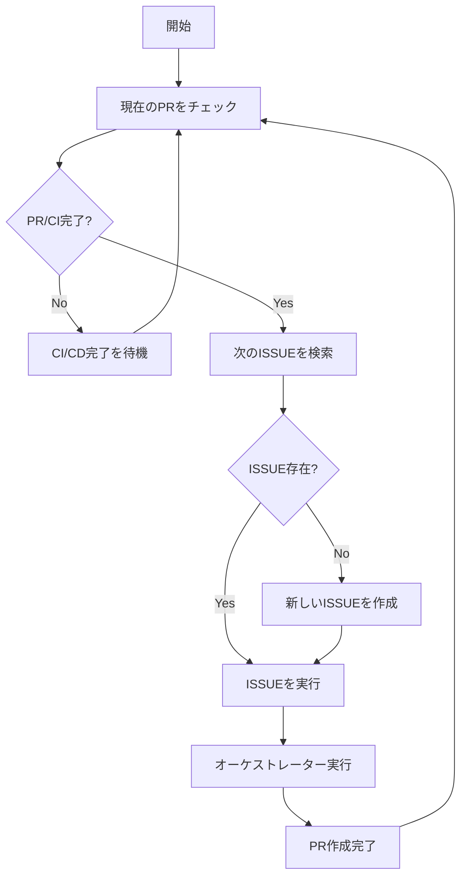

# 🤖 自律実行オーケストレーター

完全自律でタスクを継続実行するシステム。PR完了→次ISSUE実行→完了→次ISSUE実行を無限ループします。

---

## 🔄 自律実行フロー



---

## 🎯 実行コマンド

```bash
# 自律実行開始
/autonomous-orchestrator start

# 自律実行停止  
/autonomous-orchestrator stop

# 現在状況確認
/autonomous-orchestrator status

# 手動でサイクル実行
/autonomous-orchestrator cycle
```

---

## 📋 自律実行ステート管理

### 実行状態監視
```yaml
autonomous_state:
  status: running | stopped | paused | error
  current_cycle: 15
  total_completed_issues: 47
  current_pr_url: "https://github.com/owner/repo/pull/123"
  current_issue_id: "#456"
  last_execution_time: "2024-06-24T10:30:00Z"
  next_scheduled_cycle: "2024-06-24T11:00:00Z"
  
execution_history:
  - cycle: 14
    issue_id: "#445"
    pr_url: "https://github.com/owner/repo/pull/122"
    status: completed
    duration_minutes: 23
    completion_time: "2024-06-24T10:00:00Z"
```

### 設定パラメータ
```yaml
autonomous_config:
  cycle_interval_minutes: 30      # PRチェック間隔
  max_wait_for_ci_hours: 2       # CI/CD最大待機時間
  issue_search_labels:           # 検索対象ラベル
    - "ready-for-development"
    - "approved"
    - "high-priority"
  issue_creation_enabled: true   # ISSUE自動作成
  auto_creation_interval: 5      # ISSUE作成間隔（サイクル）
  max_concurrent_prs: 3          # 同時実行可能PR数
```

---

## 🔍 PR監視機能

### CI/CDチェック詳細
```text
AUTONOMOUS_PR_MONITORING:

check_sequence:
  1. GitHub API: PR status check
  2. CI pipeline: all checks green?  
  3. Required reviews: approved?
  4. Merge conflicts: resolved?
  5. Branch protection: passed?

wait_strategy:
  - initial_check: immediate
  - recheck_interval: 5 minutes
  - max_wait_time: 2 hours
  - timeout_action: create_manual_review_issue

failure_handling:
  ci_failed: |
    1. Analyze failure logs
    2. Create fix-ci ISSUE with error details
    3. Assign high priority
    4. Continue with next available ISSUE
    
  review_required: |
    1. Add comment requesting review
    2. Notify via configured channels
    3. Continue monitoring
    
  merge_conflict: |
    1. Create conflict-resolution ISSUE
    2. Include conflicting files list
    3. Mark as urgent priority
```

---

## 🎯 ISSUE管理システム

### ISSUE検索ロジック
```text
AUTONOMOUS_ISSUE_SEARCH:

search_priority:
  1. labeled: "urgent" + "ready-for-development" 
  2. labeled: "high-priority" + "approved"
  3. labeled: "ready-for-development"
  4. labeled: "approved" 
  5. open issues assigned to current user
  6. open issues without assignee

filtering_criteria:
  - exclude: "blocked", "waiting-for-review", "duplicate"
  - include: only issues with clear requirements
  - complexity: prefer medium complexity over trivial/complex
  - dependencies: skip issues with unresolved dependencies

selection_algorithm:
  factor_weights:
    - priority_label: 40%
    - creation_date: 20% (older = higher priority)
    - issue_complexity: 20% (medium = preferred)
    - estimated_effort: 20% (prefer 1-4 hour tasks)
```

### ISSUE自動作成
```text
AUTONOMOUS_ISSUE_CREATION:

trigger_conditions:
  - no_available_issues: true
  - last_creation_cycles_ago: >= 5
  - project_analysis_suggests_improvements: true

creation_strategy:
  1. PROJECT_ANALYSIS:
     - Analyze recent commits and changes
     - Identify technical debt opportunities  
     - Find missing tests/documentation
     - Detect performance optimization opportunities
     - Review security improvement possibilities

  2. ISSUE_GENERATION:
     - Generate 2-3 ISSUE candidates
     - Estimate effort (prefer 1-4 hour tasks)
     - Include clear acceptance criteria
     - Add appropriate labels and priorities

  3. AUTO_SELECTION:
     - Rank by impact vs effort ratio
     - Select highest value issue
     - Assign to autonomous execution

generated_issue_types:
  - code_quality: refactoring, cleanup, optimization
  - testing: missing tests, test improvements  
  - documentation: missing docs, outdated content
  - security: vulnerability fixes, dependency updates
  - performance: bottleneck resolution, optimization
  - features: small incremental improvements

issue_template:
  title: "[AUTO] <category>: <brief_description>"
  labels: ["auto-generated", "<priority>", "<category>"]
  body: |
    ## 🤖 自動生成されたタスク
    
    ### 目的
    <analysis_based_purpose>
    
    ### 背景  
    <project_analysis_findings>
    
    ### 実装内容
    <specific_actionable_tasks>
    
    ### 完了条件
    <measurable_acceptance_criteria>
    
    ### 推定工数
    <estimated_hours> 時間
    
    ### 生成根拠
    <analysis_reasoning>
```

---

## 🚀 オーケストレーター統合

### オーケストレーター呼び出し
```text
AUTONOMOUS_ORCHESTRATOR_EXECUTION:

execution_preparation:
  1. ISSUE content analysis
  2. Requirements extraction  
  3. Context preparation
  4. Dependency identification

orchestrator_invocation:
  command: "/orchestrator"
  arguments: |
    ISSUE ID: {{issue_id}}
    ISSUE Title: {{issue_title}}
    
    Requirements:
    {{extracted_requirements}}
    
    Context:
    {{project_context}}
    
    Expected Deliverables:
    {{acceptance_criteria}}
    
    Constraints:
    - Maximum execution time: 4 hours
    - Create feature branch: feat/auto-{{issue_id}}
    - Include comprehensive tests
    - Update documentation if needed
    - Follow existing code conventions

progress_monitoring:
  - Track orchestrator task completion
  - Monitor PR creation
  - Validate deliverables against ISSUE requirements
  - Ensure CI/CD pipeline triggers properly

success_criteria:
  - PR created with proper title/description
  - All CI checks passing
  - ISSUE requirements met
  - No security vulnerabilities introduced
  - Code quality metrics maintained
```

---

## 🛠️ エラーハンドリング & 回復

### 失敗シナリオ対応
```text
AUTONOMOUS_ERROR_RECOVERY:

orchestrator_failure:
  detection: |
    - Execution timeout (> 4 hours)
    - Critical error in task execution
    - Unable to create PR after completion
    
  recovery_actions:
    1. Analyze failure logs and context
    2. Create "orchestrator-debug" ISSUE with failure details
    3. Reduce task complexity by 50%
    4. Retry with simplified requirements
    5. If retry fails: mark ISSUE as "needs-manual-intervention"

ci_cd_perpetual_failure:
  detection: |
    - CI failing for > 6 hours
    - Multiple retry attempts failed
    - Dependency/infrastructure issues
    
  recovery_actions:
    1. Create "ci-fix" priority ISSUE
    2. Analyze failure patterns
    3. Suggest infrastructure/dependency updates
    4. Temporarily pause autonomous execution
    5. Notify maintainers for manual intervention

resource_exhaustion:
  detection: |
    - API rate limits hit
    - Container resource limits reached
    - Disk space/memory issues
    
  recovery_actions:
    1. Implement exponential backoff
    2. Reduce concurrent task limits
    3. Clean up temporary resources
    4. Switch to lower-resource task selection

infinite_loop_detection:
  detection: |
    - Same ISSUE attempted > 3 times
    - No progress for > 24 hours
    - Circular dependency detected
    
  recovery_actions:
    1. Blacklist problematic ISSUE temporarily
    2. Create "loop-breaker" analysis ISSUE
    3. Reset autonomous state to clean slate
    4. Generate fresh ISSUE candidates
```

---

## 📊 監視 & メトリクス

### パフォーマンス追跡
```text
AUTONOMOUS_METRICS:

productivity_metrics:
  - issues_completed_per_day: 3.2
  - average_cycle_time_hours: 2.8
  - success_rate_percentage: 87%
  - pr_merge_rate_percentage: 94%
  - ci_failure_rate_percentage: 13%

quality_metrics:
  - code_coverage_maintained: true
  - security_scan_pass_rate: 100%
  - code_quality_score: B+
  - test_failure_introduction_rate: 2%

efficiency_metrics:
  - api_calls_per_cycle: 15
  - resource_utilization_average: 67%
  - wait_time_percentage: 23%
  - active_development_percentage: 77%

trend_analysis:
  weekly_summary:
    - total_issues_completed: 22
    - total_prs_merged: 20
    - average_pr_size_lines: 245
    - bugs_introduced: 1
    - bugs_fixed: 4
    - net_code_quality_change: +2.3%
```

### 通知システム
```text
AUTONOMOUS_NOTIFICATIONS:

notification_triggers:
  success_milestones:
    - every_10_completed_issues
    - weekly_summary_report
    - monthly_impact_analysis
    
  attention_required:
    - ci_failing_over_1_hour
    - no_available_issues_found
    - error_rate_above_20%
    - manual_intervention_needed

notification_channels:
  - github_issue_comments
  - project_slack_channel (if configured)
  - email_digest (if configured)
  - claude_code_status_dashboard

message_templates:
  success: |
    🎉 Autonomous Orchestrator Update
    
    Completed: ISSUE #{{issue_id}}
    PR: {{pr_url}}
    Duration: {{duration_hours}}h
    Next: {{next_issue_title}}
    
  attention: |
    ⚠️ Autonomous Orchestrator Alert
    
    Issue: {{problem_description}}
    Current State: {{current_state}}
    Suggested Action: {{suggested_action}}
    
  summary: |
    📊 Weekly Autonomous Summary
    
    Completed: {{issues_count}} issues
    Merged: {{prs_count}} PRs  
    Success Rate: {{success_rate}}%
    Next Week Focus: {{suggested_focus}}
```

---

## ⚙️ システム制御

### 実行制御コマンド
```bash
# 自律実行開始（設定ファイルから設定読み込み）
/autonomous-orchestrator start

# 特定設定で開始
/autonomous-orchestrator start --interval=15 --max-wait=1h

# 一時停止（現在のタスクは完了まで継続）
/autonomous-orchestrator pause

# 即座停止（現在のタスクも中断）
/autonomous-orchestrator stop --force

# 状況確認
/autonomous-orchestrator status --detailed

# 設定表示・変更
/autonomous-orchestrator config show
/autonomous-orchestrator config set max_wait_for_ci_hours 3

# ログ確認  
/autonomous-orchestrator logs --last=24h
/autonomous-orchestrator logs --filter=error

# 手動でサイクル実行（テスト用）
/autonomous-orchestrator cycle --dry-run
/autonomous-orchestrator cycle --issue-id=123

# メトリクス確認
/autonomous-orchestrator metrics --period=week
/autonomous-orchestrator metrics --export=json

# リセット（全状態をクリア）
/autonomous-orchestrator reset --confirm
```

---

## 💡 最適化戦略

### 継続的改善
```text
AUTONOMOUS_OPTIMIZATION:

learning_mechanisms:
  task_success_patterns:
    - Track which issue types complete successfully
    - Learn optimal task complexity levels
    - Identify most productive time periods
    - Recognize common failure patterns

adaptive_scheduling:
    - Adjust cycle intervals based on CI completion times
    - Optimize issue selection based on success history
    - Dynamic resource allocation based on workload
    - Smart retry strategies based on failure analysis

self_improvement:
  weekly_analysis:
    - Review completed tasks for optimization opportunities
    - Identify bottlenecks and improvement areas
    - Generate process improvement ISSUEs
    - Update selection criteria based on outcomes
    
  quarterly_evolution:
    - Analyze long-term productivity trends
    - Suggest infrastructure improvements
    - Recommend workflow optimizations  
    - Generate strategic development ISSUEs

predictive_capabilities:
  - Estimate task completion time based on history
  - Predict CI failure likelihood
  - Identify optimal work periods
  - Suggest preventive maintenance tasks
```

---

この自律実行オーケストレーターにより、**完全自動でプロジェクトが継続的に改善・発展**していきます。