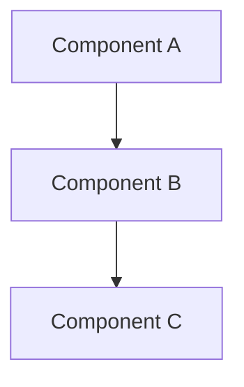
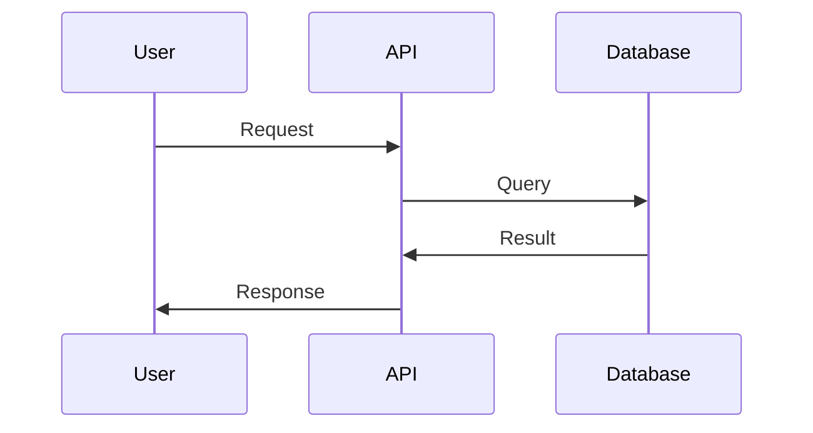

Create a comprehensive Design Document for: $ARGUMENTS

Use the built-in Design Doc template:

# [Feature Name] Design Document

**Author**: [Name]
**Date**: YYYY-MM-DD
**Reviewers**: [Names]
**Status**: Draft / In Review / Approved
**Last Updated**: YYYY-MM-DD

## Overview

[3-sentence summary of the feature]

**TL;DR**: [One sentence describing the feature and its value]

## Background

### Context
[Why is this feature needed?]
[What problem does it solve?]

### Current State
[What is the current situation?]
[What are the pain points?]

## Goals and Non-Goals

### Goals
- [Specific, measurable goal]
- [Specific, measurable goal]
- [Specific, measurable goal]

### Non-Goals
- [What this design explicitly does NOT aim to do]
- [What is out of scope]

### Success Metrics
- [Measurable metric: e.g., "Reduce latency to <200ms"]
- [Measurable metric: e.g., "Handle 10K requests/sec"]
- [Measurable metric: e.g., "99.9% uptime"]

## Detailed Design

### Architecture Overview



[Description of architecture]

### Components

#### Component 1: [Name]
**Responsibility**: [What it does]
**Technology**: [Tech stack]
**API**: [Key interfaces]

#### Component 2: [Name]
[Same structure]

### API Design

#### Endpoint 1
```http
POST /api/v1/resource
Content-Type: application/json

{
  "field": "value"
}
```

**Response**:
```json
{
  "id": "123",
  "status": "created"
}
```

### Data Model

```sql
CREATE TABLE resources (
  id UUID PRIMARY KEY,
  name VARCHAR(255),
  created_at TIMESTAMP
);
```

### Data Flow



### Security Considerations

- [Authentication/Authorization approach]
- [Data encryption (at rest, in transit)]
- [Input validation]
- [Rate limiting]

## Alternatives Considered

### Alternative 1: [Name]

**Description**: [Brief description]

**Pros**:
- [Advantage]
- [Advantage]

**Cons**:
- [Disadvantage]
- [Disadvantage]

**Why not chosen**: [Specific reason]

### Alternative 2: [Name]
[Same structure]

## Implementation Plan

### Phase 1: [Name] (Week 1-2)
- [ ] Task 1
- [ ] Task 2
- [ ] Task 3

### Phase 2: [Name] (Week 3-4)
- [ ] Task 1
- [ ] Task 2

### Dependencies
- [External dependency 1]
- [External dependency 2]

## Testing Strategy

### Unit Tests
- [What will be unit tested]
- [Target coverage: e.g., 80%]

### Integration Tests
- [What will be integration tested]
- [Test scenarios]

### End-to-End Tests
- [Critical user flows]

### Performance Tests
- [Load testing plan]
- [Expected metrics]

## Rollout Plan

### Stage 1: Internal Testing (Week 1)
- Deploy to staging
- Internal dogfooding
- Performance validation

### Stage 2: Beta Release (Week 2)
- 10% of users
- Feature flag: `enable_new_feature`
- Monitoring dashboard

### Stage 3: General Availability (Week 3)
- 100% rollout
- Monitoring and alerts

### Rollback Plan
[How to rollback if issues arise]

## Risks and Mitigation

| Risk | Probability | Impact | Mitigation |
|------|------------|--------|------------|
| [Risk 1] | High/Medium/Low | High/Medium/Low | [Mitigation strategy] |
| [Risk 2] | High/Medium/Low | High/Medium/Low | [Mitigation strategy] |

## Open Questions

- [ ] Question 1: [Unresolved item requiring discussion]
- [ ] Question 2: [Unresolved item requiring discussion]

## Appendix

### References
- [Related design docs]
- [External documentation]
- [Research papers]

### Glossary
- **Term 1**: Definition
- **Term 2**: Definition

---

## Design Doc Quality Checklist

Before review:
- [ ] All sections are complete
- [ ] Architecture diagrams are included (Mermaid recommended)
- [ ] API examples are concrete and executable
- [ ] Success metrics are measurable (具体的な数値)
- [ ] Alternatives are documented with reasoning
- [ ] Security considerations are addressed
- [ ] Testing strategy is comprehensive
- [ ] Rollout plan includes monitoring and rollback
- [ ] No vague expressions (避ける: "適切に", "柔軟に")
- [ ] Concrete examples provided

**Best Practices**:
- Use Mermaid diagrams for visualization
- Include concrete code examples
- Define measurable success criteria
- Document trade-offs explicitly
- Specify risks with mitigation plans
