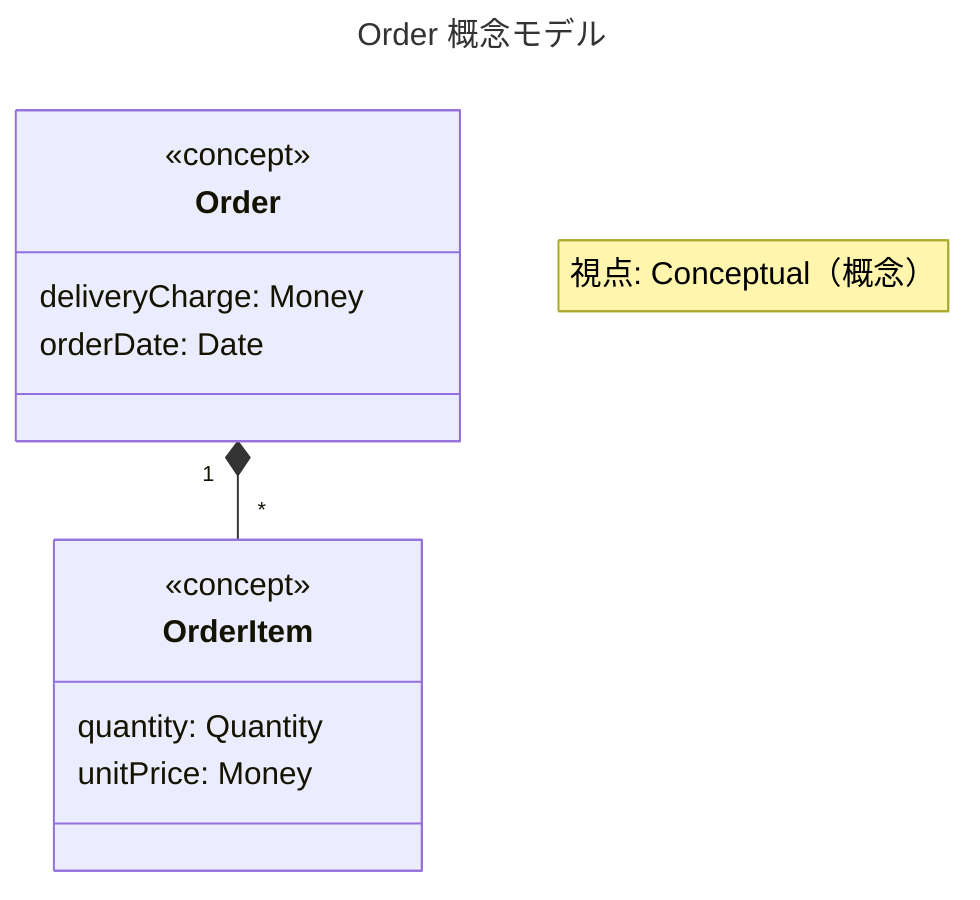

# /model: 目的を持ったモデリング

モデリング図を作成する前に視点と目的を明確にし、modeling サブエージェントに委譲する。

## 使用方法

```
/model-creator <subject>
```

**引数**:
- `subject`: モデリング対象（必須）
  - 例: `Order`, `顧客管理`, `チェックアウトプロセス`

---

## Step 1: 視点の確認

ユーザーに以下を確認する:

```
📐 モデリング: $ARGUMENTS

どの視点でモデリングしますか？

┌─────────────────────────────────────────────────────┐
│ 1. 概念モデル (Conceptual)                          │
│    → 現実世界・ビジネスの視点で理解する              │
│    → 「$ARGUMENTSとは何か？」                       │
├─────────────────────────────────────────────────────┤
│ 2. 仕様モデル (Specification)                       │
│    → ソフトウェア要件を定義する                     │
│    → 「$ARGUMENTSシステムは何をすべきか？」         │
├─────────────────────────────────────────────────────┤
│ 3. 実装モデル (Implementation)                      │
│    → コード構造・設計を説明する                     │
│    → 「$ARGUMENTSはどう実装されているか？」         │
└─────────────────────────────────────────────────────┘

番号で選択してください [1/2/3]:
```

## Step 2: 目的の確認（任意）

```
このモデルが答える問いは何ですか？（Enter でスキップ可）
例: 「注文と顧客の関係を明確にしたい」
```

## Step 3: modeling サブエージェントに委譲

視点と目的が決まったら、**modeling サブエージェントを使用して**図を生成する。

```
Use the modeling subagent to create a {perspective} model of {subject}.
Purpose: {question}

The subagent should:
1. Read the purposeful-modeling skill references
2. Apply strict rules for the {perspective} perspective
3. Generate a Mermaid class diagram
4. Validate the output
```

## Step 4: 結果の表示

サブエージェントから返された図と検証結果を表示する。

---

## 出力例

```
📐 モデリング結果: Order（概念モデル）

目的: 注文ドメインの構造を理解する



✅ 検証結果:
  ✓ 視点が図に明示されている
  ✓ ステレオタイプ <<concept>> が適用されている
  ✓ 実装詳細（ID, メソッド）が含まれていない
```

---

## なぜサブエージェントに委譲するか

| 問題 | サブエージェントで解決 |
|------|----------------------|
| モデリングルールでメインコンテキストが汚染される | 独立コンテキストで実行 |
| 視点が途中で混在する | 単一視点を維持 |
| 追加修正で文脈が失われる | サブエージェントが状態を保持 |
