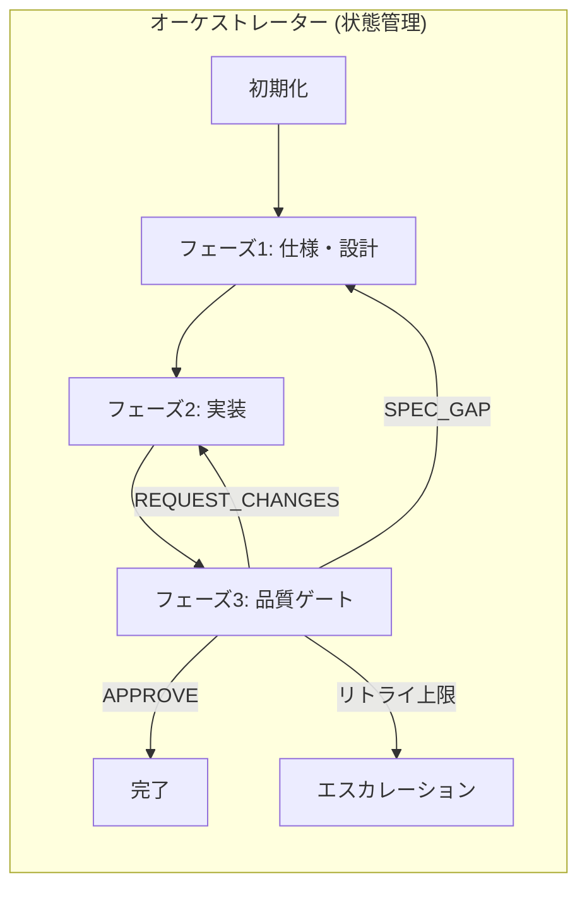

# マルチエージェントワークフロー

このコマンドで、$ARGUMENTS を対象に仕様策定→実装→品質ゲートを順に実施します。

## ワークフロー図



## 実行手順

### Step 1: ワークフロー状態の初期化/再開

`.claude/workflow-state.json` を確認し、状態を管理:

```bash
cat .claude/workflow-state.json 2>/dev/null || echo "新規ワークフロー開始"
```

新規の場合、以下の初期状態を作成:

```json
{
  "id": "wf-{timestamp}",
  "request": "$ARGUMENTS",
  "current_phase": "INIT",
  "iteration": 0,
  "phase_history": [],
  "blocker_history": [],
  "created_at": "{ISO8601}",
  "updated_at": "{ISO8601}"
}
```

### Step 2: フェーズ実行ループ

**orchestrator-agent** の遷移ロジックに従い、以下を繰り返す:

#### フェーズ1: 仕様・設計 (SDA)

**spec-design-agent** サブエージェントを呼び出し:

- 入力: `$ARGUMENTS` + 既存コンテキスト
- 出力: 「Spec & Acceptance」セクション
- 完了後: `current_phase` を `DA` に更新

#### フェーズ2: 実装 (DA)

**delivery-agent** サブエージェントを呼び出し:

- 入力: SDA出力 + 既存コード
- 出力: 「Delivery」セクション
- 完了後: `current_phase` を `QGA` に更新

#### フェーズ3: 品質ゲート (QGA)

**quality-gate-agent** サブエージェントを呼び出し:

- 入力: DA出力 + SDA仕様
- 出力: 「Quality Gate」セクション + Gate Decision

### Step 3: 遷移判定

QGAの `Gate Decision` に基づき遷移:

| Gate Status     | return_to | 次アクション             |
| --------------- | --------- | ------------------------ |
| APPROVE         | -         | COMPLETE へ遷移          |
| REQUEST_CHANGES | DA        | iteration++ → DA へ返却  |
| SPEC_GAP        | SDA       | iteration++ → SDA へ返却 |

### Step 4: エスカレーション判定

以下の条件で自動化を停止し、人間判断を要求:

1. `iteration >= 3`
2. 同一 `blocker_id` が2回以上検出
3. SDAへの返却が2回以上

## 状態スキーマ

`.claude/workflow-state.schema.json` を参照。主要フィールド:

```typescript
interface WorkflowState {
  id: string;
  request: string;
  current_phase: "INIT" | "SDA" | "DA" | "QGA" | "COMPLETE" | "ESCALATED";
  iteration: number;
  phase_history: PhaseResult[];
  blocker_history: BlockerIssue[];
}
```

## 完了条件

- 仕様と受け入れ条件がリクエストとトレースできる形で出力されている
- 実装サマリとテストコマンドが提示されている
- 品質ゲートの判定が `APPROVE` である
- `.claude/workflow-state.json` の `current_phase` が `COMPLETE`

## エスカレーション報告フォーマット

```markdown
🚨 ワークフロー・エスカレーション

ワークフローID: {id}
リクエスト: {request}
イテレーション: {iteration}/3

理由: {escalation_reason}

フェーズ履歴:

- [{timestamp}] SDA: SUCCESS
- [{timestamp}] DA: RETURNED (BLOCKER-001)
- [{timestamp}] DA: RETURNED (BLOCKER-001 再検出)

未解決ブロッカー:

- BLOCKER-001: セキュリティ問題 (2回検出)

根本原因分析:

- DAが問題の実装方法を理解していない可能性
- SDA仕様に具体的実装手順が不足

推奨アクション:

1. SDAフェーズで詳細仕様を追加
2. 人間開発者によるレビュー

ユーザー判断を依頼します。
```

## サブエージェント一覧

| エージェント       | 役割               | 成果物                  |
| ------------------ | ------------------ | ----------------------- |
| orchestrator-agent | 状態管理・遷移制御 | workflow-state.json     |
| spec-design-agent  | 仕様策定           | Spec & Acceptance       |
| delivery-agent     | 実装               | Delivery                |
| quality-gate-agent | 品質検証           | Quality Gate + Decision |

## 導入方法

このディレクトリ（`.claude/.claude/`）を対象プロジェクトの `.claude/` にコピー:

```bash
cp -r .claude/.claude/* /path/to/your-project/.claude/
```
