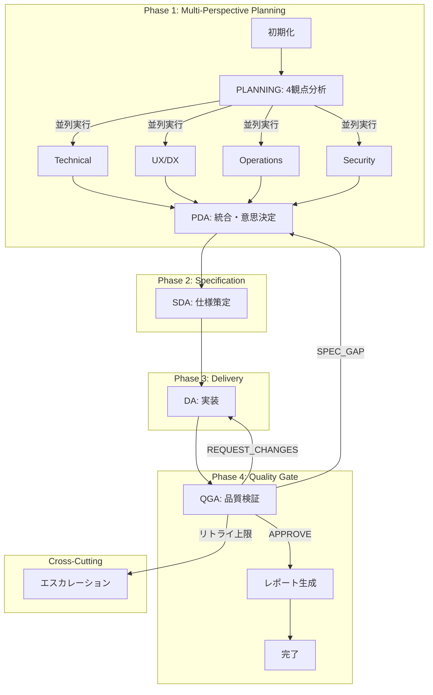

# マルチエージェントワークフロー v2

このコマンドで、$ARGUMENTS を対象に **複数観点プランニング → 仕様策定 → 実装 → 品質ゲート** を順に実施します。

## 使用方法

```bash
# Agent Teams モード（PLANNING フェーズで相互議論）
/multi-agent --mode=teams "ユーザー認証機能の追加"

# Sub-agent モード（既存動作、デフォルト）
/multi-agent --mode=sub-agents "ユーザー認証機能の追加"

# モード指定なし（Sub-agent モード）
/multi-agent "ユーザー認証機能の追加"
```

## 実行モード

### 自動判断モード (`--mode=auto`、デフォルト)

タスクの特性を分析し、最適な実行モードを自動推奨します。

**判断基準**:
- **タスクの並列性**: 完全独立 → Agent Teams 推奨
- **ファイル競合リスク**: 異なるファイル → Agent Teams 推奨
- **通信パターン**: 相互議論が必要 → Agent Teams 推奨
- **タスク規模**: 大規模（10+ファイル） → Agent Teams 推奨
- **複雑性**: セキュリティ要件、アーキテクチャ変更など → Agent Teams 推奨
- **トークンコスト許容**: 品質重視 → Agent Teams 推奨

**使用例**:
```bash
# 自動判断（推奨方式を提示）
/multi-agent "ユーザー認証機能の追加"

# 自動判断を明示的に指定
/multi-agent --mode=auto "ユーザー認証機能の追加"
```

**推奨例**:
```
分析結果:
- 推定ファイル数: 15ファイル
- 複雑性: MEDIUM
- セキュリティ要件: あり

推奨方式: Agent Teams (PLANNING フェーズのみ)
理由: セキュリティと UX/DX の間で矛盾が予想されるため、
      Planning フェーズで相互議論により早期解決が望ましい。

期待効果:
- 分析品質: 向上（矛盾の早期発見）
- トークンコスト: +30-50% (HIGH)
- 実行時間: +20%

確信度: 85%

この推奨方式で進めますか? [Y/n]
```

### Agent Teams モード (`--mode=teams`)

PLANNING フェーズで Agent Teams を使用し、4観点が相互議論により矛盾を早期発見します。

**メリット**:
- 観点間の矛盾を PLANNING フェーズ内で解決（PDA 負荷 30% 削減）
- 相互レビューにより分析品質向上
- 矛盾の早期発見によりリトライ削減

**デメリット**:
- トークンコスト増加（+30-50%）
- 実行時間増加（+20%）

**推奨ユースケース**:
- 複雑なプロジェクト（セキュリティ要件、アーキテクチャ変更など）
- 観点間の矛盾が予想される場合
- 品質重視のプロジェクト

### Sub-agent モード (`--mode=sub-agents`)

PLANNING フェーズで Sub-agent を並列呼び出しします。

**メリット**:
- トークンコスト低（Agent Teams の 60-70%）
- 実行時間短（Agent Teams より 20% 高速）

**デメリット**:
- 観点間の矛盾は PDA で初めて発見される

**推奨ユースケース**:
- シンプルなタスク
- トークンコスト重視
- 迅速性重視

## ワークフロー図


```mermaid
flowchart TB
    subgraph "Phase 1: Multi-Perspective Planning"
        INIT[初期化] --> PLANNING[PLANNING: 4観点分析]
        PLANNING --> |並列実行| TECH[Technical]
        PLANNING --> |並列実行| UX[UX/DX]
        PLANNING --> |並列実行| OPS[Operations]
        PLANNING --> |並列実行| SEC[Security]
        TECH & UX & OPS & SEC --> PDA[PDA: 統合・意思決定]
    end

    subgraph "Phase 2: Specification"
        PDA --> SDA[SDA: 仕様策定]
    end

    subgraph "Phase 3: Delivery"
        SDA --> DA[DA: 実装]
    end

    subgraph "Phase 4: Quality Gate"
        DA --> QGA[QGA: 品質検証]
        QGA --> |APPROVE| RPT[レポート生成]
        QGA --> |REQUEST_CHANGES| DA
        QGA --> |SPEC_GAP| PDA
        RPT --> COMPLETE[完了]
    end

    subgraph "Cross-Cutting"
        QGA --> |リトライ上限| ESCALATE[エスカレーション]
    end
```

## 改善ポイント（v2）

| 課題 | 改善内容 |
|-----|---------|
| プランニングの精度 | 4観点（Technical/UX-DX/Operations/Security）で並列分析 → PDA で統合・意思決定 |
| QA の精度 | 受け入れ条件（AC）ベースのトレーサブルな検証、エビデンス記録 |
| 過程の検証 | decision_log + トレーサビリティマトリクス + 完了時レポート生成 |

## 実行手順

### Step 1: ワークフロー状態の初期化/再開

`.claude/workflow-state.json` を確認し、状態を管理:

```bash
cat .claude/workflow-state.json 2>/dev/null || echo "新規ワークフロー開始"
```

新規の場合、以下の初期状態を作成:

```json
{
  "id": "wf-{timestamp}",
  "request": "$ARGUMENTS",
  "current_phase": "INIT",
  "iteration": 0,
  "planning_context": {
    "perspective_analyses": [],
    "planning_decision": null,
    "acceptance_criteria": []
  },
  "decision_log": [],
  "traceability": {},
  "phase_history": [],
  "blocker_history": [],
  "created_at": "{ISO8601}",
  "updated_at": "{ISO8601}"
}
```

### Step 2: フェーズ実行ループ

**orchestrator-agent** の遷移ロジックに従い、以下を繰り返す:

#### Phase 1: Multi-Perspective Planning

##### PLANNING フェーズ（並列実行）

**planning-perspective-agent** を4つの観点で**並列に**呼び出し:

```
# 単一メッセージで4つの Task ツールを並列呼び出し
Task(planning-perspective-agent, perspective: "technical", ...)
Task(planning-perspective-agent, perspective: "ux-dx", ...)
Task(planning-perspective-agent, perspective: "operations", ...)
Task(planning-perspective-agent, perspective: "security", ...)
```

各観点の出力:
- concerns: 懸念事項（重要度付き）
- opportunities: 改善機会
- constraints: 制約条件
- acceptance_criteria_suggestions: 提案する受け入れ条件

##### PDA フェーズ（統合・意思決定）

**planning-decision-agent** を呼び出し:

- 入力: 4観点の分析結果
- 処理: 合意点の特定、矛盾の解決、トレードオフ評価
- 出力:
  - consensus_points: 合意事項
  - conflicts_resolved: 解決した矛盾（理由付き）
  - trade_offs_accepted: 受容したトレードオフ
  - acceptance_criteria: 確定した受け入れ条件
  - decision_log: 意思決定の記録

完了後: `current_phase` を `SDA` に更新

#### Phase 2: 仕様策定 (SDA)

**spec-design-agent** を呼び出し:

- 入力: PDA の統合プラン + 受け入れ条件
- 出力: 「Spec & Acceptance」セクション
- 完了後: `current_phase` を `DA` に更新

#### Phase 3: 実装 (DA)

**delivery-agent** を呼び出し:

- 入力: SDA 出力 + 既存コード
- 出力: 「Delivery」セクション
- 追加責務: トレーサビリティ（要件→実装→テストの対応）を記録
- 完了後: `current_phase` を `QGA` に更新

#### Phase 4: 品質ゲート (QGA)

**quality-gate-agent** を呼び出し:

- 入力: DA 出力 + SDA 仕様 + PDA 受け入れ条件
- 処理:
  - 各受け入れ条件を個別に検証（PASS/FAIL/PARTIAL）
  - エビデンス（テスト出力、カバレッジレポート等）を記録
  - トレーサビリティマトリクスを完成
- 出力: 「Quality Gate」セクション + Gate Decision

### Step 3: 遷移判定

QGAの `Gate Decision` に基づき遷移:

| Gate Status     | return_to | 次アクション                |
| --------------- | --------- | --------------------------- |
| APPROVE         | -         | レポート生成 → COMPLETE へ   |
| REQUEST_CHANGES | DA        | iteration++ → DA へ返却     |
| SPEC_GAP        | PDA       | iteration++ → PDA へ返却    |

### Step 4: エスカレーション判定

以下の条件で自動化を停止し、人間判断を要求:

1. `iteration >= 3`
2. 同一 `blocker_id` が2回以上検出
3. PDA への返却が2回以上

### Step 5: 完了時レポート生成

APPROVE 時に以下のレポートを生成:

```markdown
# ワークフロー完了レポート

## エグゼクティブサマリー
| 項目 | 値 |
|-----|-----|
| ワークフローID | {id} |
| リクエスト | {request} |
| 完了日時 | {updated_at} |
| イテレーション | {iteration} |

## プランニング概要
### 検討した観点
- Technical: {key_concerns}
- UX/DX: {key_concerns}
- Operations: {key_concerns}
- Security: {key_concerns}

### 主要な意思決定
| 決定事項 | 選択肢 | 理由 |
|---------|-------|------|
{decision_log から抽出}

### 受容したトレードオフ
{trade_offs_accepted を要約}

## 受け入れ条件検証結果
| AC-ID | 条件 | 検証結果 | エビデンス |
|-------|-----|---------|----------|
{acceptance_criteria から抽出}

## トレーサビリティマトリクス
| 要件 | 実装ファイル | テストファイル | 検証状態 |
|-----|-------------|---------------|---------|
{traceability から抽出}

## フェーズ履歴
{phase_history を時系列で表示}

## リスクと残課題
{blocker_history で resolved: false のものを表示}
```

## 状態スキーマ

`.claude/workflow-state.schema.json` を参照。主要フィールド:

```typescript
interface WorkflowState {
  id: string;
  request: string;
  current_phase: "INIT" | "PLANNING" | "PDA" | "SDA" | "DA" | "QGA" | "COMPLETE" | "ESCALATED";
  iteration: number;
  planning_context: {
    perspective_analyses: PerspectiveAnalysis[];
    planning_decision: PlanningDecision;
    acceptance_criteria: AcceptanceCriterion[];
  };
  decision_log: DecisionLogEntry[];
  traceability: {
    requirement_to_implementation: Record<string, string[]>;
    implementation_to_test: Record<string, string[]>;
    test_to_verification: Record<string, VerificationResult>;
  };
  phase_history: PhaseResult[];
  blocker_history: BlockerIssue[];
}
```

## 完了条件

- 複数観点でのプランニングが実施され、意思決定が記録されている
- 受け入れ条件がリクエストとトレースできる形で定義されている
- 各受け入れ条件が検証され、エビデンスが記録されている
- 実装サマリとテストコマンドが提示されている
- 品質ゲートの判定が `APPROVE` である
- トレーサビリティマトリクスが完成している
- `.claude/workflow-state.json` の `current_phase` が `COMPLETE`

## エスカレーション報告フォーマット

```markdown
🚨 ワークフロー・エスカレーション

ワークフローID: {id}
リクエスト: {request}
イテレーション: {iteration}/3

理由: {escalation_reason}

フェーズ履歴:
- [{timestamp}] PLANNING: SUCCESS
- [{timestamp}] PDA: SUCCESS
- [{timestamp}] SDA: SUCCESS
- [{timestamp}] DA: RETURNED (BLOCKER-001)
- [{timestamp}] DA: RETURNED (BLOCKER-001 再検出)

意思決定履歴:
- [scope] OAuth をスコープ外に → 理由: 初期リリース迅速化
- [trade-off] セッション24時間 → 理由: セキュリティとUXのバランス

未解決ブロッカー:
- BLOCKER-001: セキュリティ問題 (2回検出)

根本原因分析:
- DAが問題の実装方法を理解していない可能性
- PDA 仕様に具体的実装手順が不足

推奨アクション:
1. PDA フェーズで詳細仕様を追加
2. 人間開発者によるレビュー

ユーザー判断を依頼します。
```

## サブエージェント一覧

| エージェント               | 役割                     | 成果物                            | 並列 |
| -------------------------- | ------------------------ | --------------------------------- | ---- |
| orchestrator-agent         | 状態管理・遷移制御       | workflow-state.json               | -    |
| planning-perspective-agent | 観点別分析               | PerspectiveAnalysis               | Yes  |
| planning-decision-agent    | 統合・意思決定           | PlanningDecision + AC             | No   |
| spec-design-agent          | 仕様策定                 | Spec & Acceptance                 | No   |
| delivery-agent             | 実装                     | Delivery + Traceability           | No   |
| quality-gate-agent         | 品質検証                 | Quality Gate + Traceability + Report | No   |

## 導入方法

このディレクトリ（`.claude/.claude/`）を対象プロジェクトの `.claude/` にコピー:

```bash
cp -r .claude/.claude/* /path/to/your-project/.claude/
```
